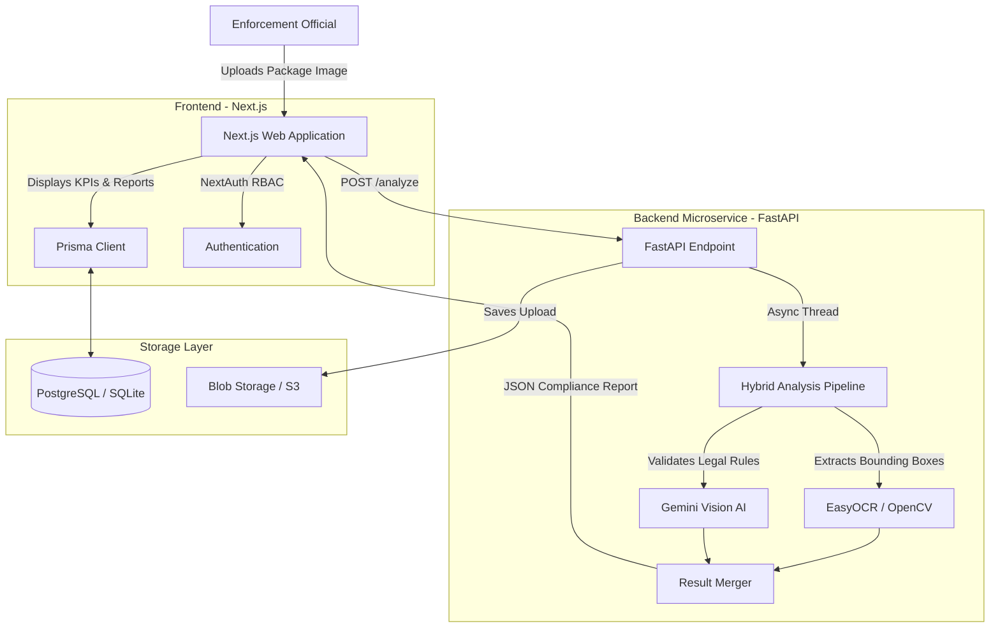

# Technical Architecture & Deployment Framework
**Smart India Hackathon 2024 | Problem Statement ID: 26034**  
**Ministry of Consumer Affairs, Food & Public Distribution**

---

## 1. Executive Summary
This document outlines the software architecture, technology stack, and deployment framework for the **Automated Legal Metrology Compliance System**. The system is designed to assist enforcement officials in automatically scanning packaged commodity labels, detecting mandatory declarations, and verifying compliance against the *Legal Metrology (Packaged Commodities) Rules, 2011*.

## 2. System Architecture Overview
The application is built on a **modern, decoupled microservices architecture**. It separates the high-performance user interface from the computationally heavy AI/OCR processing engine.

### High-Level Flow
1. **Input:** The enforcement official uploads a package image via the web application.
2. **Processing (Backend):** The image is routed to the Python microservice, which utilizes a hybrid pipeline of local Optical Character Recognition (OCR) and a Large Multimodal Model (LMM).
3. **Analysis:** Spatial bounding boxes are mapped, and text is evaluated against the 5 primary Legal Metrology rules.
4. **Storage:** Results, compliance scores, and violations are permanently persisted in a relational database.
5. **Output:** The official views the results on an interactive dashboard and can export them to digitally generated PDF reports.

---

## 3. Technology Stack

### 3.1 Frontend (User Interface & Client Logic)
* **Framework:** Next.js 15 (React) utilizing the App Router for server-side rendering (SSR) and optimized routing.
* **Styling:** Tailwind CSS for a responsive, accessible, and adaptive user interface.
* **State & Data Visualization:** Recharts (for dashboard KPI visualization) and Framer Motion (for fluid bounding box overlays).
* **Authentication:** NextAuth.js with Credentials/JWT for secure, Role-Based Access Control (RBAC).

### 3.2 Backend (AI & OCR Processing Engine)
* **Framework:** FastAPI (Python) for asynchronous, high-throughput API endpoints.
* **OCR Engine:** EasyOCR / OpenCV for spatial text localization and bounding box generation.
* **AI Engine:** Google Gemini Vision AI for contextual extraction of entities (Product Name, Manufacturer, MRP, Net Quantity) and advanced semantic rule validation (e.g., detecting misleading date formats).
* **Concurrency:** `asyncio` thread pooling to prevent deep-learning models from blocking the ASGI event loop.

### 3.3 Database & Storage
* **ORM:** Prisma ORM for type-safe database querying.
* **Database:** SQLite (Development) -> easily migratable to PostgreSQL (Production).
* **File Storage:** Local filesystem storage for image uploads (migratable to AWS S3).

---

## 4. Architectural Diagram

---

## 5. Security & Authentication
* **Role-Based Access Control (RBAC):** The system enforces roles (`Admin` vs. `Inspector`). Only authenticated officials can generate reports or modify team members.
* **Stateless Sessions:** JWT (JSON Web Tokens) are utilized to maintain secure, stateless sessions across the frontend and backend.
* **CORS & Payload Limits:** The FastAPI backend restricts Cross-Origin requests to authorized frontend domains and enforces a strict 10MB payload limit to prevent DDoS attacks via massive file uploads.

---

## 6. Deployment Framework

The system is designed to be cloud-agnostic, supporting deployment on AWS, Azure, or Government Cloud (NIC).

### 6.1 Containerization
The system is fully containerized using **Docker**.
* `Dockerfile.web`: Packages the Next.js application.
* `Dockerfile.api`: Packages the FastAPI application, installing required C++ build tools for OpenCV and PyTorch for EasyOCR.

### 6.2 Recommended Cloud Topology (Production)
1. **Frontend Hosting:** Vercel or AWS Amplify (provides global CDN caching and edge routing).
2. **Backend Compute:** AWS Elastic Container Service (ECS) with AWS Fargate. Provides auto-scaling capabilities necessary for handling concurrent, heavy OCR workloads during peak inspection hours.
3. **Database Hosting:** Amazon RDS (PostgreSQL) in a private subnet for secure, ACID-compliant storage of inspection records.
4. **Blob Storage:** Amazon S3 for storing raw evidentiary photographs of packaged commodities.

### 6.3 CI/CD Pipeline
* **Version Control:** GitHub/GitLab.
* **Actions:** Automated GitHub Actions trigger on push to `main`, running static type checking (`tsc`), linting, and building the Docker images before pushing them to an Elastic Container Registry (ECR).

---

## 7. Mapping to SIH Requirements

| SIH Requirement | Implementation in System |
| :--- | :--- |
| **User-friendly web application** | Responsive Next.js PWA with Dark Mode and accessibility standards. |
| **Automated extraction & detection** | Hybrid EasyOCR + Gemini Vision pipeline extracts text accurately regardless of package orientation. |
| **Rule-based compliance checking** | Prompt-engineered AI strict checks against Legal Metrology Rules, 2011 (MRP, Net Qty, Dates). |
| **Dashboard for monitoring** | Dedicated `/` route features dynamic Recharts (Pie/Area charts) for violation trends. |
| **Repository of scanned products** | Relational DB stores interconnected `Products`, `Inspections`, and `Violations`. |
| **Export of reports** | `jsPDF` integration generates dynamic, printable PDF reports with photographic evidence. |
