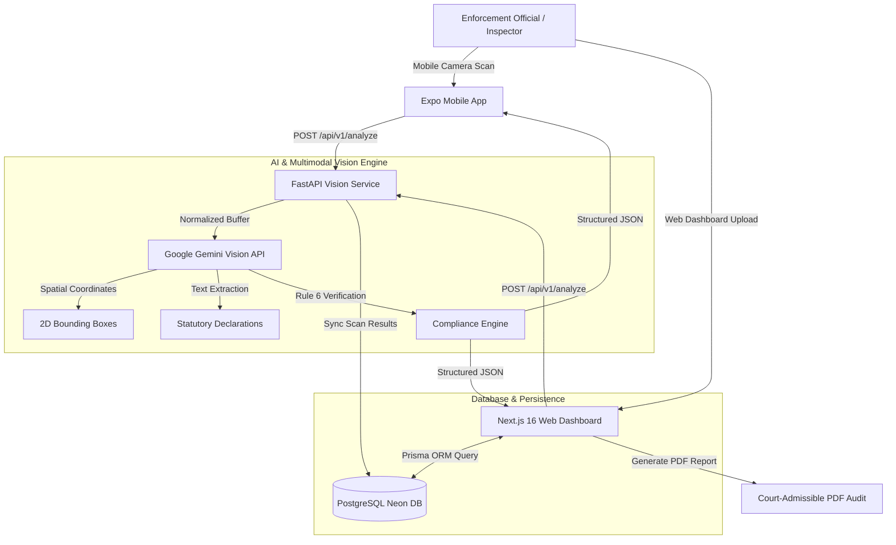

# Technical Architecture & Deployment Framework
**Smart India Hackathon 2024 | Problem Statement ID: 26034**  
**Ministry of Consumer Affairs, Food & Public Distribution**

---

## 1. Executive Summary
This document outlines the software architecture, technology stack, and deployment framework for the **Automated Legal Metrology Compliance System**. The system is designed to assist enforcement officials in automatically scanning packaged commodity labels, detecting mandatory statutory declarations, and verifying compliance against the *Legal Metrology (Packaged Commodities) Rules, 2011 (Rule 6)*.

---

## 2. System Architecture Overview
The application is built on a **modern, decoupled microservices architecture** that connects a high-performance executive web dashboard and mobile inspector app with a cloud-native multimodal AI vision engine.

### High-Level Flow
1. **Input:** An enforcement official captures or uploads packaging photographs via the Next.js Web Dashboard or the Expo React Native Mobile App.
2. **Processing (Backend):** The image is routed to the Python FastAPI microservice, which applies Pillow dimension normalization and formats the payload for multimodal spatial vision inference.
3. **AI Vision & Spatial Localization:** Google Gemini Multimodal Vision (`gemini-2.5-flash` / `gemini-3.5-flash`) extracts statutory text declarations and predicts exact normalized 2D spatial bounding boxes (`[ymin, xmin, ymax, xmax]`) directly in a single pass without local OCR overhead.
4. **Rule Validation:** Declarations are checked against mandatory Rule 6 statutory clauses (MRP, USP, Net Weight, Manufacturer, Expiry, Customer Care, Country of Origin).
5. **Storage:** Audit results, spatial coordinates, and compliance scores are persisted in a serverless PostgreSQL database (Neon) via Prisma ORM.
6. **Output:** Real-time compliance feedback, interactive bounding-box overlays, and downloadable, court-admissible PDF audit certificates.

---

## 3. Technology Stack

### 3.1 Frontend (Web Dashboard)
* **Framework:** Next.js 16 (React 19) utilizing the App Router with Turbopack.
* **Styling & Animations:** Tailwind CSS v4, React Bits (SpotlightCard, ShinyText, DecryptedText, TrueFocus).
* **State & Data Visualization:** Recharts (KPI visualization) and custom SVG spatial overlays for bounding boxes.
* **Authentication:** NextAuth.js with Credentials/JWT for secure, Role-Based Access Control (RBAC).
* **Export:** `jsPDF` & `jspdf-autotable` for automated statutory compliance certificates.

### 3.2 Mobile Application (Inspector App)
* **Framework:** React Native with Expo SDK 52 (Cross-platform Android & iOS).
* **Distribution:** Expo Application Services (EAS) Over-The-Air (OTA) updates on the `preview` channel.
* **Hardware Integration:** `expo-image-picker` (camera/gallery) and `expo-haptics` for tactile feedback.

### 3.3 Backend (AI Vision Engine)
* **Framework:** FastAPI (Python) with Uvicorn ASGI.
* **Vision & Text Engine:** **Google Gemini Multimodal Vision API** (`google-genai` SDK) utilizing cascading multi-key rotation and multi-model fallback (`gemini-2.5-flash`, `gemini-3.5-flash`) to eliminate `429 RESOURCE_EXHAUSTED` errors.
* **Image Processing:** Python Pillow (PIL) for image dimension calibration and format handling.
* **Architecture Rationale:** Pure multimodal vision replaces legacy OpenCV/Tesseract/EasyOCR pipelines, eliminating Out-Of-Memory (OOM) crashes and heavy C++ system binary dependencies on cloud containers.

### 3.4 Database & Storage
* **ORM:** Prisma ORM for type-safe database access.
* **Database:** Serverless PostgreSQL on Neon DB with connection pooling.
* **File Storage:** Local filesystem with public HTTP hosting, mirror-synced to Next.js static uploads.

---

## 4. Architectural Diagram

```mermaid
graph TD
    %% User Layer
    U[Enforcement Official / Inspector] -->|Mobile Camera Scan| M[Expo Mobile App]
    U -->|Web Dashboard Upload| W[Next.js 16 Web Dashboard]
    
    %% API Gateway Layer
    M -->|POST /api/v1/analyze| API[FastAPI Vision Service]
    W -->|POST /api/v1/analyze| API
    
    %% AI Processing Layer
    subgraph AI_Engine [AI & Multimodal Vision Engine]
        API -->|Normalized Buffer| GEMINI[Google Gemini Vision API]
        GEMINI -->|Spatial Coordinates| BBOX[2D Bounding Boxes]
        GEMINI -->|Text Extraction| TEXT[Statutory Declarations]
        GEMINI -->|Rule 6 Verification| RULES[Compliance Engine]
    end
    
    %% Database Layer
    subgraph Storage [Database & Persistence]
        API -->|Sync Scan Results| DB[(PostgreSQL Neon DB)]
        W <-->|Prisma ORM Query| DB
    end
    
    %% Output
    RULES -->|Structured JSON| W
    RULES -->|Structured JSON| M
    W -->|Generate PDF Report| PDF[Court-Admissible PDF Audit]
```

---

## 5. Security & Compliance
* **Role-Based Access Control (RBAC):** Authenticated enforcement officials and administrators maintain segregated access permissions.
* **Stateless Sessions:** Secure JSON Web Tokens (JWT) for authentication.
* **Statutory Regulatory Adherence:** Mapped to Rule 6 of the Legal Metrology (Packaged Commodities) Rules, 2011, as enforced by the Ministry of Consumer Affairs.

---

## 6. Mapping to SIH Requirements

| SIH Requirement | Implementation in System |
| :--- | :--- |
| **User-friendly web & mobile app** | Next.js 16 Dark-Mode Dashboard + Expo React Native Inspector Mobile App. |
| **Automated extraction & detection** | Google Gemini Multimodal Vision extracts statutory text and generates 2D bounding boxes. |
| **Rule-based compliance checking** | Prompt-engineered AI checks against Legal Metrology Rules, 2011 (MRP, Net Qty, Dates, Mfg, USP). |
| **Dashboard for monitoring** | Executive overview featuring Recharts analytics, violation rates, and recent audits. |
| **Repository of scanned products** | PostgreSQL (Neon) database storing synchronized `Products`, `Inspections`, and `Violations`. |
| **Export of reports** | Dynamic `jsPDF` generation of official compliance inspection certificates. |
